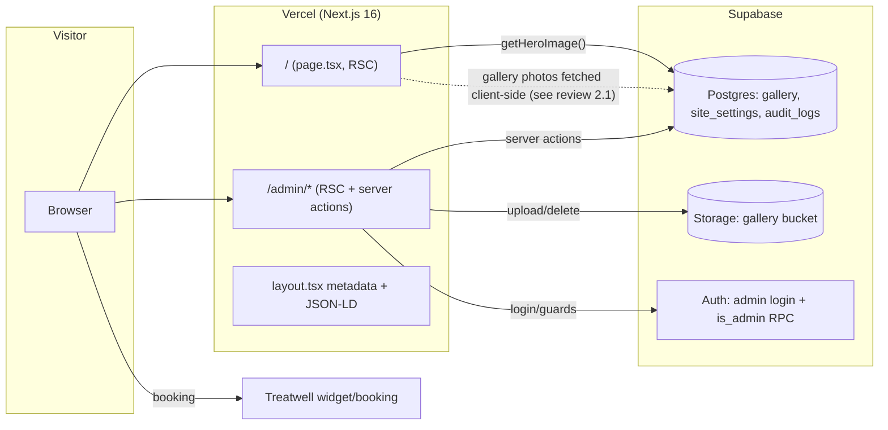
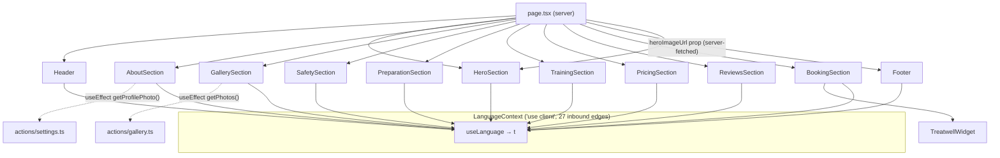
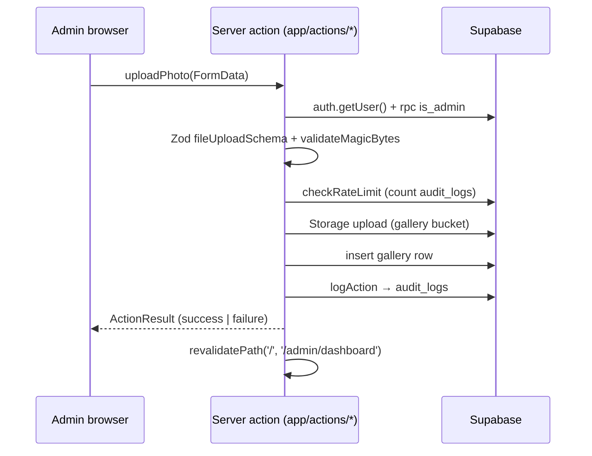

# Architecture

Technical map of the li_zagar_tan landing site. For the audit and backlog see [SITE_REVIEW.md](SITE_REVIEW.md) (Russian); for change proposals see [`openspec/changes/`](../openspec/changes/).

## Bird's-eye view

A single-page marketing site (Next.js 16 App Router) with a small Supabase-backed admin panel. Static content lives in typed i18n files; dynamic content (gallery, hero and profile photos) lives in Supabase Postgres + Storage and is managed through `/admin`. Bookings are delegated entirely to an embedded Treatwell widget.

## Page composition

`app/page.tsx` is an async Server Component; every section it renders is a Client Component because they all call `useLanguage()`. The Graphify knowledge graph confirms this is the codebase's tightest coupling: **`useLanguage()` is the most-connected node (27 edges), ahead of `createClient()` (23)** — see the interactive map in [`graphify-out/graph.html`](../graphify-out/graph.html).

**Consequence:** nearly the whole landing renders client-side, and gallery/about images are absent from server HTML. Fixing the fetches is `openspec/changes/ssr-gallery-and-about`; removing the client-side i18n coupling requires per-language routes (below).

## i18n

- Languages: `lt` (default), `ru`, `en`. Translations are typed objects (`app/i18n/types.ts` guarantees key parity across `translations/{lt,ru,en}.ts`).
- Active language: `LanguageContext` (client) → persisted to `localStorage` **and** a `language` cookie.
- The cookie is the server's only signal: `app/layout.tsx` reads it in `generateMetadata()` and for `<html lang>`.
- Limits: switching is client-only; first-time visitors and crawlers always get `lt`; the hreflang alternates advertise `/?lang=xx` URLs that currently do nothing.

**Decision record (hreflang):** short-term we make `?lang=` real (read it on init with priority query > stored > navigator) so the advertised alternates are truthful — `openspec/changes/fix-hreflang-language-urls`. The proper long-term fix is a `[lang]` route segment (`/lt`, `/ru`, `/en`) with server-rendered translations; that also dissolves the `useLanguage()` client coupling. It is deliberately **not** part of the current backlog change because it needs its own design (routing, redirects, content parity) — revisit after the quick fix ships.

## Data layer

- Clients: `app/lib/supabase.ts` (browser) and `app/lib/supabase-server.ts` (RSC/actions, cookie adapter). Both use the **anon key only** — authorization is delegated to Supabase RLS + the `is_admin` RPC. No service-role key exists in the app.
- Mutations return the `ActionResult` discriminated union from `app/lib/actions.ts`; reads (`getPhotos`, `getHeroImage`, `getProfilePhoto`) currently swallow errors and return empty results (review finding 6.6).
- Tables actually used: `gallery`, `site_settings` (keys `hero_image`, `profile_photo`), `audit_logs`. The generated `app/types/database.ts` also contains `services`, `reviews`, `promotions`, `course_*`, `visits`, `profiles` — schema shared with a larger project, unused by this frontend today but a ready-made foundation for the roadmap items (DB-driven reviews/pricing, courses).

## Admin area

- `/admin` — login (Supabase email/password). `/admin/dashboard` — stats, hero/profile managers, upload form, drag-to-reorder grid. `/admin/audit-logs` — last 100 audit entries.
- Guarding today: dashboard layout does a server-side `auth.getUser()`; audit-logs relies on its action only; **there is no `middleware.ts`** — centralizing session refresh + route guards is `openspec/changes/harden-admin`.
- Every mutation: auth check → `is_admin` RPC → Zod + magic-bytes validation → rate limit (audit-log counting; currently fails open) → storage/DB write → audit log.

## Analytics & consent

| Tracker | Where | Consent-gated? |
| --- | --- | --- |
| Google Analytics | `GoogleAnalyticsWrapper.tsx` (ID hardcoded) | ✅ localStorage `cookie-consent`, polled every 1s |
| Meta Pixel | `layout.tsx` (env-gated) | ❌ loads for everyone |
| Vercel Insights | `layout.tsx` | ❌ unconditional (cookieless) |

Target state (see `openspec/changes/fix-analytics-consent` spec): all marketing trackers behind consent, event-driven state, IDs from env.

## SEO surfaces

- `app/layout.tsx` — per-language metadata (`metadataByLanguage`), OG/Twitter, canonical, hreflang, Google verification.
- `app/components/StructuredData.tsx` — `BeautySalon` JSON-LD (address, geo, hours, `aggregateRating` from `app/config/reviews.ts`).
- `app/robots.ts`, `app/sitemap.ts` — generated; sitemap is homepage-only today.
- Known inconsistencies (broken schema image, two fallback domains) are catalogued in the review §2 and fixed by `openspec/changes/fix-seo-structured-data`.

## Conventions

- Display constants → `app/config/` (`reviews.ts` today; `site.ts`, `pricing.ts` planned).
- Server actions → `app/actions/`, returning `ActionResult`; always audit-log admin mutations.
- Every user-facing string exists in all three locales; the types enforce it.
- Docs: owner-facing docs in Russian, technical docs in English.

## Keeping the knowledge graph fresh

`graphify-out/` is generated by [Graphify](https://github.com/safishamsi/graphify). After code changes run `graphify update .` (local AST extraction, no API key). `graphify query "question"` answers questions against `graph.json`; `graphify explain "useLanguage"` describes a node and its neighbors.
